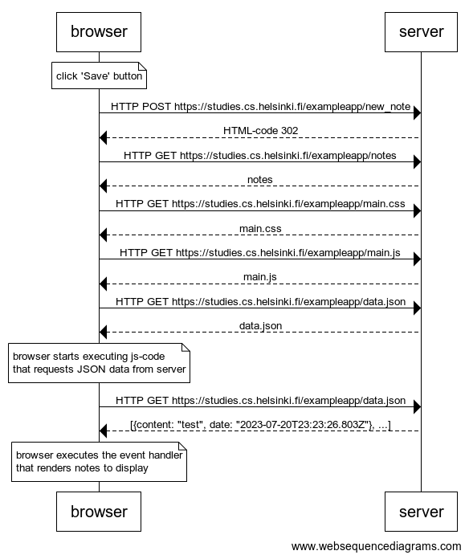

note over browser:
click 'Save' button
end note
browser->server: HTTP POST https://studies.cs.helsinki.fi/exampleapp/new_note
server-->browser: HTML-code 302
browser->server: HTTP GET https://studies.cs.helsinki.fi/exampleapp/notes
server-->browser: notes
browser->server: HTTP GET https://studies.cs.helsinki.fi/exampleapp/main.css
server-->browser: main.css
browser->server: HTTP GET https://studies.cs.helsinki.fi/exampleapp/main.js
server-->browser: main.js
browser->server: HTTP GET https://studies.cs.helsinki.fi/exampleapp/data.json
server-->browser: data.json

note over browser:
browser starts executing js-code
that requests JSON data from server
end note

browser->server: HTTP GET https://studies.cs.helsinki.fi/exampleapp/data.json
server-->browser: [{content: "test", date: "2023-07-20T23:23:26.803Z"}, ...]

note over browser:
browser executes the event handler
that renders notes to display
end note

