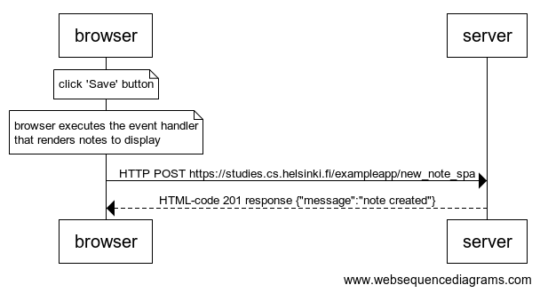

note over browser:
click 'Save' button
end note
note over browser:
browser executes the event handler
that renders notes to display
end note
browser->server: HTTP POST https://studies.cs.helsinki.fi/exampleapp/new_note_spa
server-->browser: HTML-code 201 response {"message":"note created"}

